<p align="center">
  
</p>

<h1 align="center">OpenClaw Dashboard</h1>

<p align="center">
  A modern, self-hosted web dashboard for <a href="https://github.com/openclaw/openclaw">OpenClaw</a> AI agents.<br/>
  Monitor models, cron jobs, skills, usage, memory, and more — all from a clean UI.
</p>

<p align="center">
  
  
  
  
</p>

---

## ⚡ Quick Start

Already running OpenClaw? Paste this prompt into your agent:

> Set up the OpenClaw Dashboard: clone https://github.com/joaoleitegmr/openclaw-dashboard, install dependencies with npm install, configure the .env file pointing to my OpenClaw instance, and start it with npm run dev

That's it — your agent will handle the rest. 🦞

---

## 📸 Screenshots

### 📊 Overview
System status at a glance — CPU, memory, disk, uptime, costs, active jobs, and projects.
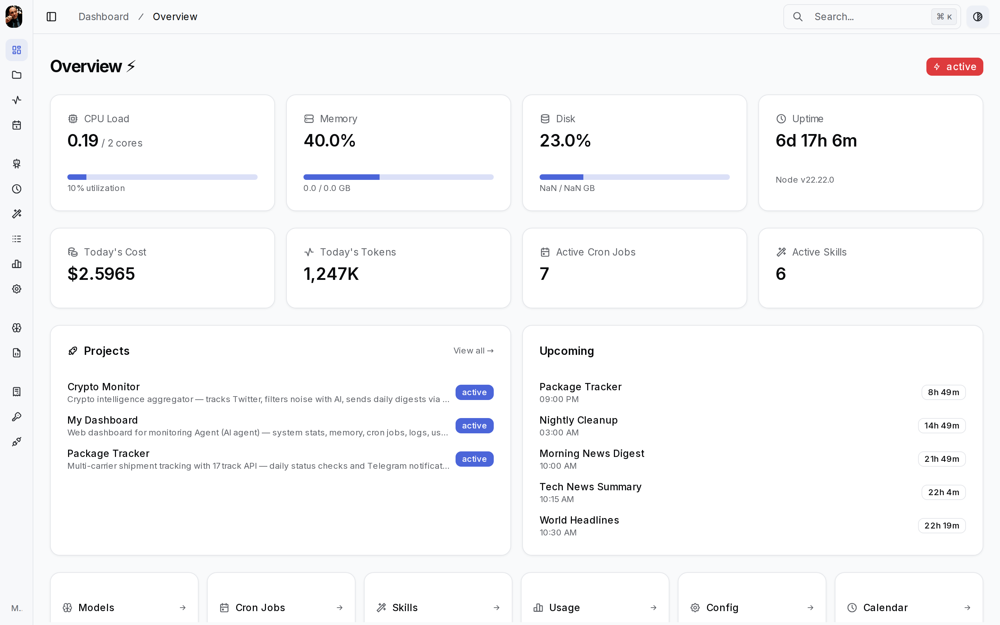

### 📁 Projects
All tracked projects with tech stacks, descriptions, and start dates.
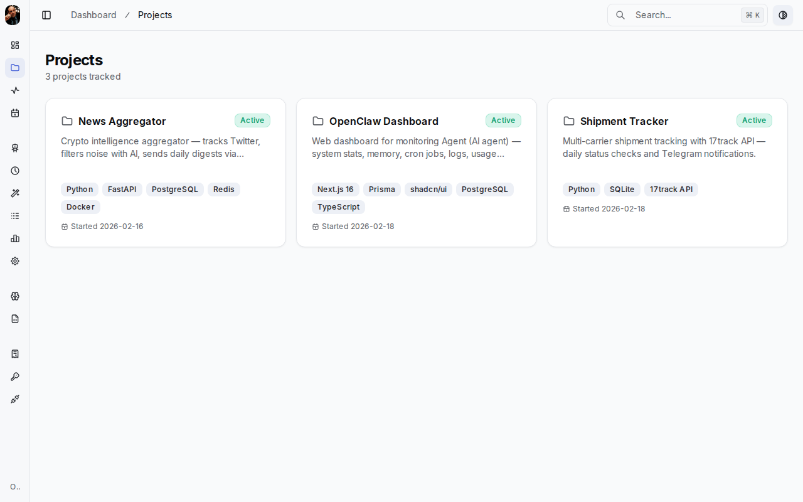

### 📋 Activity
Live activity feed — task runs, cron executions, errors, and system events.
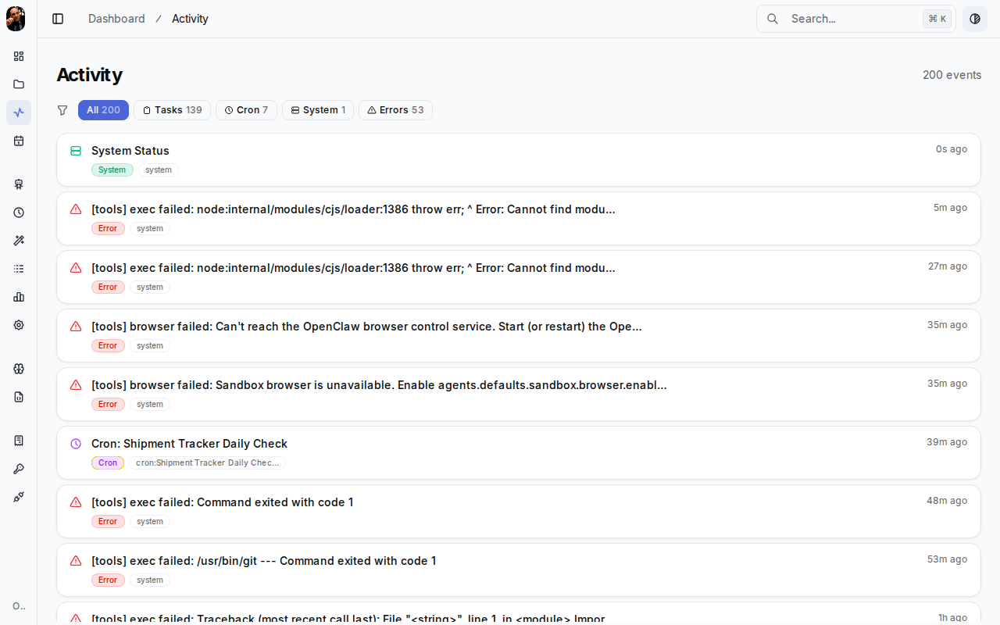

### 📅 Calendar
Monthly calendar view generated from cron job schedules.
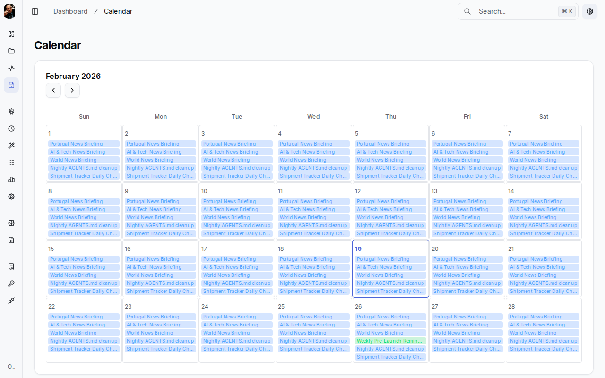

### 🤖 Models
AI model routing at a glance — Primary, Fallback, Sub-Agent, and Embedding roles with provider and pricing info.
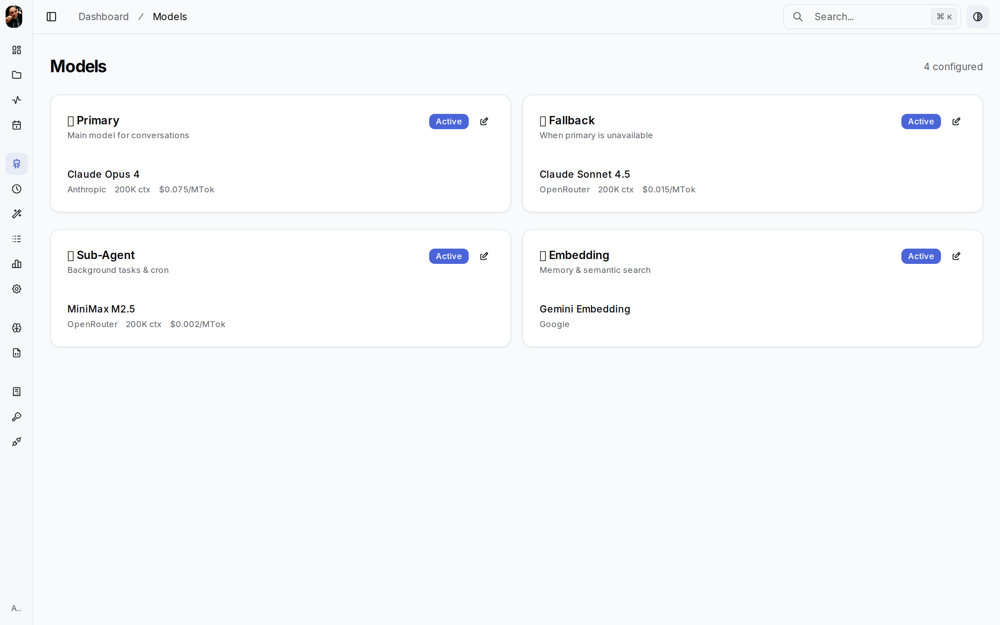

### ⏰ Cron Jobs
Active and inactive jobs with schedules, last run status, next run countdown, and error tracking.
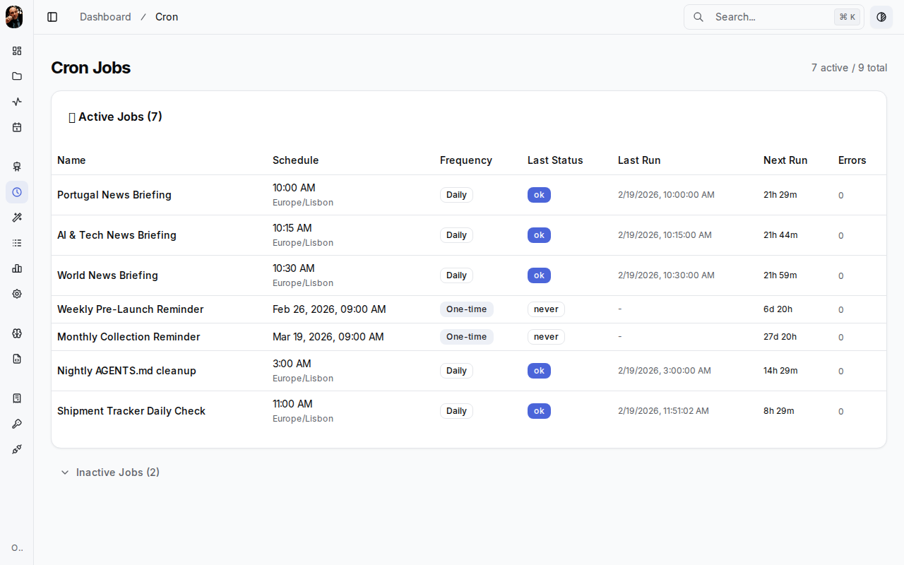

### 📈 Usage
Token and cost analytics with daily charts (7d / 30d / all time) and per-model breakdown.
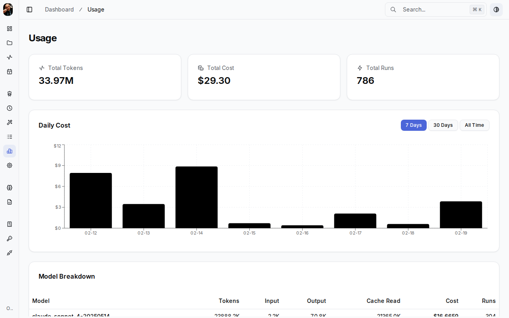

### 🧠 Memory
Browse long-term memory, daily notes, and guides with full markdown rendering.
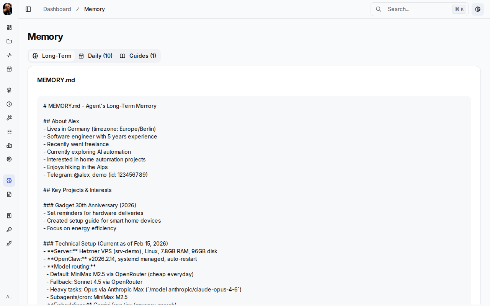

### 📄 Config Files
Workspace configuration file browser — AGENTS.md, SOUL.md, TOOLS.md, and more.
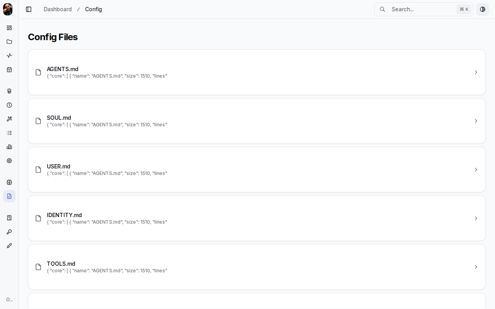

### 💰 Expenses
Monthly cost tracking for subscriptions and API services with category labels.
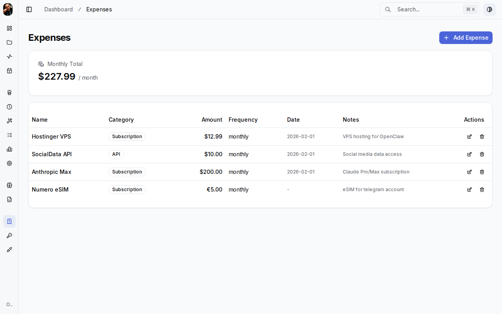

### 🔑 API Keys
Connected API keys with masked credentials, provider types, plans, and rate limits.
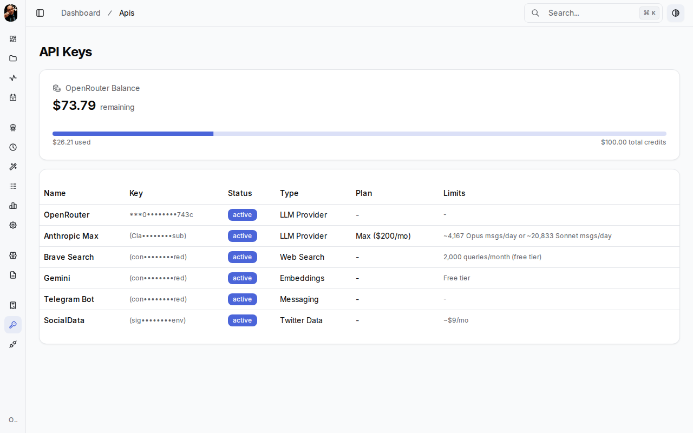

### 🔗 Accounts
Connected service accounts — Telegram, Gmail, Google Drive, Twitter/X, Cloudflare, and more.
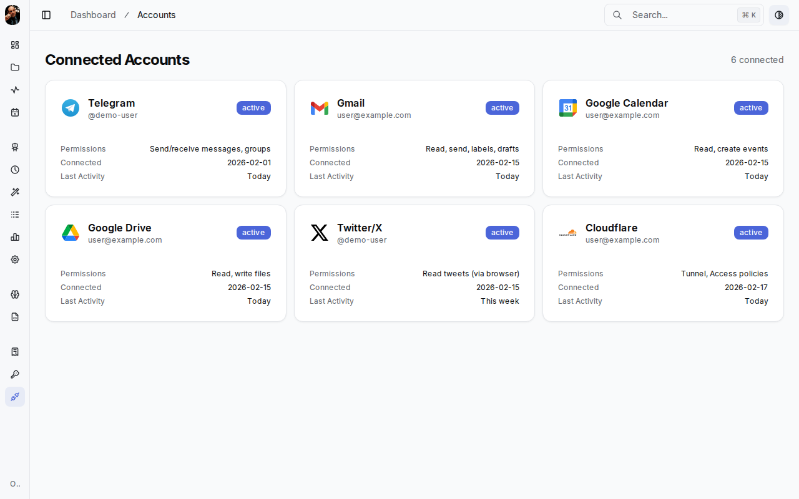

---

## ✨ All Features

| Feature | Description |
|---------|-------------|
| **Overview** | System stats, costs, projects, upcoming jobs |
| **Models** | AI model routing with role-based cards |
| **Cron Jobs** | Active/inactive views with schedules & status |
| **Skills** | Installed skills with activation status |
| **Usage** | Token & cost charts (7d / 30d / all time) |
| **Calendar** | Monthly view generated from cron schedules |
| **Memory** | Long-term memory, daily notes, guides viewer |
| **Logs** | Filtered log viewer with level badges & auto-refresh |
| **Config** | Workspace config file browser |
| **Setup** | Agent info, infrastructure, models, security overview |
| **Expenses** | Cost tracking with category breakdown |
| **Search** | Full workspace search (Cmd+K) |
| **Settings** | Theme, appearance, and notification config |

---

## 🏗️ Architecture

```
Browser → Cloudflare Tunnel (optional) → Next.js Dashboard (:3100)
                                              ↓
                                     OpenClaw Control UI API (:3001)
```

The dashboard proxies all API calls through Next.js API routes to the OpenClaw Control UI running on `localhost:3001`.

---

## 📦 Installation

### Prerequisites

- **Node.js** 22+ (see `.nvmrc`)
- **OpenClaw** running with Control UI enabled on port 3001
- **npm** or **bun**

### Setup

```bash
# Clone
git clone https://github.com/joaoleitegmr/openclaw-dashboard.git
cd openclaw-dashboard

# Install
npm install

# Configure
cp env.example.txt .env
# Edit .env — at minimum, ensure OPENCLAW_API_URL points to your instance

# Development
npm run dev

# Production
npm run build
npm start -- -p 3100
```

### Environment Variables

| Variable | Default | Description |
|----------|---------|-------------|
| `OPENCLAW_API_URL` | `http://localhost:3001` | OpenClaw Control UI API URL |
| `PORT` | `3100` | Dashboard port |

Authentication is handled by [Clerk](https://clerk.com) — keyless mode works out of the box for development. See `env.example.txt` for all available options.

### Run as a systemd service (recommended for production)

```bash
sudo tee /etc/systemd/system/openclaw-dashboard.service > /dev/null <<EOF
[Unit]
Description=OpenClaw Dashboard
After=network.target

[Service]
Type=simple
User=root
WorkingDirectory=/path/to/openclaw-dashboard
ExecStart=/usr/bin/node node_modules/.bin/next start -p 3100
Restart=always
RestartSec=5
Environment=NODE_ENV=production

[Install]
WantedBy=multi-user.target
EOF

sudo systemctl enable --now openclaw-dashboard
```

### Optional: Cloudflare Tunnel

For secure remote access without exposing ports:

```bash
cloudflared tunnel --url http://localhost:3100
```

Pair with [Cloudflare Access](https://developers.cloudflare.com/cloudflare-one/) for authentication (Google login, email allowlist, etc.).

---

## ⚙️ OpenClaw Configuration

Make sure your OpenClaw config has the Control UI enabled:

```yaml
controlUI:
  enabled: true
  port: 3001
```

The dashboard reads from these API endpoints:

| Endpoint | Data |
|----------|------|
| `/api/status` | System status & uptime |
| `/api/models` | Model configuration |
| `/api/cron` | Cron job listing |
| `/api/skills` | Installed skills |
| `/api/usage` | Token usage & costs |
| `/api/config` | Configuration files |
| `/api/logs` | Recent logs |
| `/api/search` | Workspace search |

---

## 🛠️ Tech Stack

- **Framework:** Next.js 16 (App Router, Turbopack)
- **Styling:** Tailwind CSS v4 + [shadcn/ui](https://ui.shadcn.com)
- **Charts:** Recharts
- **Icons:** Tabler Icons + Lucide React
- **Search:** KBar (Cmd+K command palette)
- **Auth:** Clerk (keyless mode for development)
- **Themes:** Multiple themes with dark mode support

---

## 🤝 Contributing

Contributions are welcome! Whether it's a bug fix, new feature, or documentation improvement — we'd love your help.

1. **Fork** the repository
2. **Create** your feature branch: `git checkout -b feature/amazing-feature`
3. **Commit** your changes: `git commit -m 'Add amazing feature'`
4. **Push** to the branch: `git push origin feature/amazing-feature`
5. **Open** a Pull Request

### Development

```bash
npm run dev       # Start dev server with Turbopack
npm run lint      # Run ESLint
npm run format    # Format with Prettier
```

---

## ⚠️ Disclaimer

This dashboard was **entirely built by an [OpenClaw](https://github.com/openclaw/openclaw) AI agent** — I'm not a developer and have not audited the code. I guided and customized the project, but all code was generated and written by the AI. Use at your own discretion, review the code yourself, and feel free to improve it via PRs.

---

## 📄 License

MIT — see [LICENSE](LICENSE) for details.

---

<p align="center">
  Built with 🦞 by an <a href="https://github.com/openclaw">OpenClaw</a> agent, guided by a human
</p>
